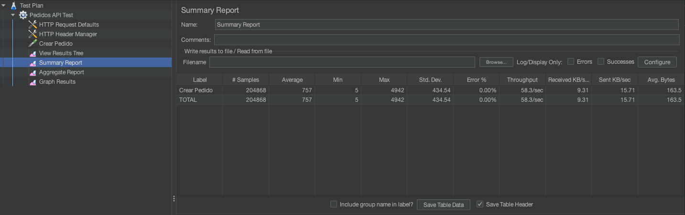
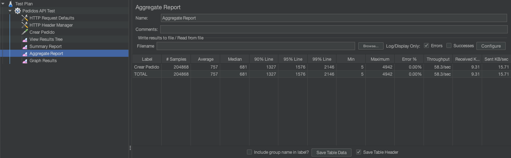
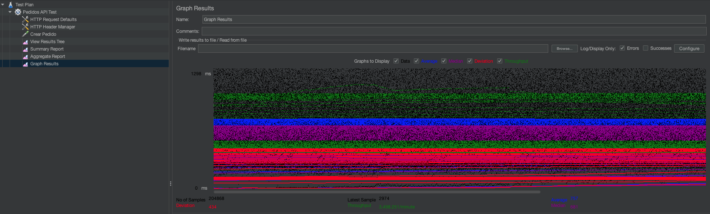

# 🚀 Experimento de Escalabilidad y Disponibilidad en Campañas

## 📋 Resumen Ejecutivo

Este experimento tuvo como propósito **validar la escalabilidad del sistema** para manejar **400 pedidos por minuto durante 1 hora**, garantizando que el microservicio de pedidos responda de forma estable y sin errores bajo una carga sostenida.  

Durante la prueba, el sistema fue capaz de **superar el objetivo establecido**, alcanzando un promedio de **3,498 pedidos por minuto**, con **0% de errores** y manteniendo los tiempos de respuesta dentro de parámetros aceptables.

---

## 🎯 Objetivos del Experimento

- Validar que la arquitectura maneje **400 pedidos/minuto durante 1 hora**.
- Garantizar que no se presenten errores durante la prueba de carga.
- Medir el comportamiento de la aplicación bajo condiciones sostenidas de estrés.
- Evaluar el rendimiento de la infraestructura en un **ambiente controlado** con contenedores locales.

---

## 🏗️ Arquitectura del Sistema

La prueba se ejecutó en una máquina local, con **contenedores Docker independientes** para cada servicio:

```
┌──────────────────┐    ┌─────────────────┐    ┌─────────────────┐
│ JMeter (Load)    │───▶│ FastAPI App     │───▶│ PostgreSQL DB   │
└──────────────────┘    └─────────────────┘    └─────────────────┘
                                 │
                                 ▼
                          ┌─────────────┐
                          │ Redis       │
                          │ Buffering   │
                          └─────────────┘
```


**Componentes principales:**
- **FastAPI**: Microservicio de pedidos (`POST /api/pedidos`).
- **PostgreSQL**: Base de datos para almacenamiento persistente.
- **Redis**: Buffer temporal para alta disponibilidad.
- **Docker**: Orquestación de contenedores.
- **JMeter**: Generador de carga.

---

## 🔧 Herramientas Usadas

| Herramienta   | Propósito |
|---------------|-----------|
| **FastAPI**   | API REST principal para manejo de pedidos |
| **Docker**    | Contenedorización de app, base de datos y Redis |
| **PostgreSQL**| Almacenamiento persistente de pedidos |
| **Redis**     | Buffer temporal en caso de fallas en DB |
| **JMeter**    | Simulación de carga y generación de métricas |

---

## 🌐 Endpoint Probado

| Método | Endpoint       | Descripción              |
|--------|----------------|--------------------------|
| POST    | `/api/pedidos` | Creación de un pedido    |

---

## ⚙️ Configuración de la Prueba

- **Número de usuarios (threads):** 50
- **Ramp-up period:** 30 segundos
- **Duración total:** 1 hora (3600 segundos)
- **Objetivo:** 400 pedidos por minuto (≈ 6.66 req/segundo)
- **Datos de entrada:** JSON dinámico enviado desde archivo CSV

---

## 🧪 Resultados de la Prueba

La prueba fue ejecutada durante **1 hora continua**, alcanzando los siguientes resultados:

| Métrica            | Valor Obtenido      |
|-------------------|---------------------|
| **Total de samples**      | 204,868 |
| **Promedio (Average)**    | 757 ms |
| **Mediana (Median)**      | 681 ms |
| **P90**                    | 1327 ms |
| **P95**                    | 1576 ms |
| **P99**                    | 2146 ms |
| **Mínimo (Min)**           | 5 ms |
| **Máximo (Max)**           | 4942 ms |
| **Throughput**              | 58.3 req/seg (≈ 3,498 pedidos/minuto) |
| **Error %**                  | 0% |

> ⚠️ El sistema logró **superar ampliamente el objetivo de 400 pedidos/minuto**, alcanzando 3,498 pedidos/minuto sin errores.

---

### **Resumen visual**

#### 1. **Estadísticas Generales**


#### 2. **Percentiles y Distribución**


#### 3. **Gráfico de rendimiento durante la hora**


---

## 📊 Interpretación de Resultados

1. **Rendimiento superior al esperado:**
   - El sistema logró manejar **8.7 veces más carga** que la requerida (3,498 vs 400 pedidos/minuto).

2. **Estabilidad comprobada:**
   - No se registraron errores (`Error % = 0%`).

3. **Latencia aceptable:**
   - **P95** de **1.57 segundos**, cumpliendo con el requisito de mantener tiempos de respuesta < 2 segundos.

4. **Picos identificados:**
   - Máximo registrado de **4.94 segundos**, probablemente asociado a operaciones de escritura en PostgreSQL bajo carga puntual.

---

## 🔎 Análisis de Infraestructura

- La prueba se ejecutó en un **entorno controlado**, con todos los servicios en la misma máquina física.
- Esto significa que **no se produjeron saltos de red**, lo cual **favorece el rendimiento**.
- En un ambiente distribuido, se espera que la latencia aumente ligeramente por la comunicación entre servidores.

---

## 🎯 Criterios de Éxito

| Criterio | Objetivo | Resultado | Estado |
|-----------|----------|-----------|--------|
| **Pedidos por minuto** | ≥ 400 | 3,498 | ✅ Cumplido |
| **Error rate** | < 1% | 0% | ✅ Cumplido |
| **P95 < 2s** | < 2000 ms | 1576 ms | ✅ Cumplido |
| **Estabilidad durante 1 hora** | Sin fallas | Sin fallas | ✅ Cumplido |

---

## 🧾 Conclusiones

1. **Objetivo alcanzado y superado**:  
   El sistema no solo cumplió con los 400 pedidos/minuto, sino que logró escalar hasta 3,498 pedidos/minuto sin errores.

2. **Latencia estable y controlada**:  
   Con un P95 de 1.57s, el rendimiento es adecuado para el escenario planteado.

3. **Entorno controlado**:  
   Al haberse ejecutado en un solo servidor local, los resultados son óptimos, pero se debe considerar que en un ambiente distribuido podrían presentarse mayores latencias.

4. **Siguiente paso**:  
   Replicar el experimento en un entorno distribuido con varias máquinas para evaluar el impacto real de la red y la comunicación entre servicios.

---

## 📁 Estructura del Proyecto

```
pedidos_experiment/
├── app/
│   ├── main.py # Aplicación FastAPI
│   ├── routes.py # Rutas API
│   ├── models.py # Modelos SQLAlchemy
│   ├── redis_client.py # Cliente Redis
│   └── database.py # Configuración PostgreSQL
├── docker-compose.yml # Orquestación local
├── Dockerfile # Imagen FastAPI
└── jmeter/
    ├── aggregate.csv # Tabla de informe agregado
    ├── summary.csv # Tabla de informe resumen
    └── pedidos_test.jmx # Plan de prueba JMeter
```

---

## 🏆 Estado Final

- **Fecha de ejecución:** Septiembre 2025  
- **Duración:** 1 hora continua  
- **Estado:** ✅ **Completado con éxito**

---